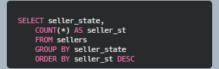
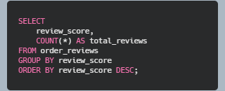
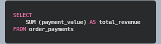
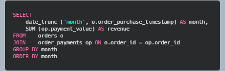
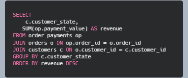
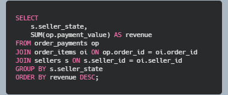
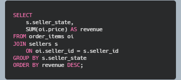

#### Question: Which states contribute most customers?

Most customers are in state SP (41746). States RJ and MG also have more than 10K customers. Total nunmber of states are 27

#### Question: States vs sellers: Which states contribute the most sellers?

State SP has the heights number of sellers (1849). PR and MG have 349 and 244 sellers consecutively. 

#### What payment methods are popular?

*Result* shows that the most popular payment type is credit card. There are 3 more payment methods. 

#### How are review scores distributed?

The reviews are quite positive; most of the reviewers rated it the best.

#### Average review score

*Result:* The average review score is 4.086 which demonstrates a high satisfaction among the customers.

### Revenue analysis

#### Find total revenue

Total revenue was 16 million for the entire duration given in the dataset.

#### Find revenue by month.

The revenue by does not show a specific trend like a hike on a particular month or a group of months (as we usually see during the month of November due to black friday or during the month of December due to the Christmas). However, during the months of the year 2018 is much higher compared to the months of the other years.

#### Find revenue by states
This is a complex situation where three tables should be involved. 

States SP, RJ, and MG contribute to the most amount of revenue. This also alighs with the number of customers and sellers in those states that was shown during dataset analysis. 

#### Find revenue by seller
This is a tricky question. One way to solve it as following:

But since there may be orders that contain multiple items, an order might be counted multiple times, which will lead to a wrong answer. Instead of the above query, the following is much simpler and accuratly represent the actual revenue.

