#### Question: Which states contribute most customers?

Most customers are in state SP (41746). States RJ and MG also have more than 10K customers. Total nunmber of states are 27

#### Question: States vs sellers: Which states contribute the most sellers?

State SP has the heights number of sellers (1849). PR and MG have 349 and 244 sellers consecutively. 

#### What payment methods are popular?

*Result* shows that the most popular payment type is credit card. There are 3 more payment methods. 

#### How are review scores distributed?

The reviews are quite positive; most of the reviewers rated it the best.

#### Average review score

*Result:* The average review score is 4.086 which demonstrates a high satisfaction among the customers.

### Revenue analysis

#### Find total revenue

Total revenue was 16 million for the entire duration given in the dataset.

#### Find revenue by month.

The revenue by does not show a specific trend like a hike on a particular month or a group of months (as we usually see during the month of November due to black friday or during the month of December due to the Christmas). However, during the months of the year 2018 is much higher compared to the months of the other years.

#### Find revenue by states
This is a complex situation where three tables should be involved. 

States SP, RJ, and MG contribute to the most amount of revenue. This also alighs with the number of customers and sellers in those states that was shown during dataset analysis. 

#### Find revenue by seller
This is a tricky question. One way to solve it as following:

But since there may be orders that contain multiple items, an order might be counted multiple times, which will lead to a wrong answer. Instead of the above query, the following is much simpler and accuratly represent the actual revenue.

### Top product category
Finding the top category product can be with respect to revenue or with respect to the number of products sold. 
#### Top product category with respect to revenue earned

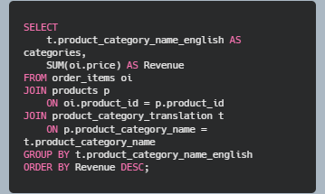

There are 71 categories of products. The product names are translated into their respective english names with the help of *product_category_translation* table. The *result* of the above query shows that *health_beauty* category generates the most revenue, whereas the *watches_gifts*, *bed_bath_table*, *sports_leisure*, and *computer_accessories* categories are not much behind as well. 

#### Top category with respect to the unit sold

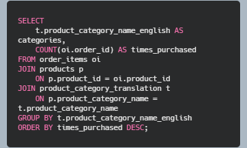

*bed_bath_table* category products are sold the most whereas the *health_beauty* category places second. It reveals that the *health_beauty* category products produces higher profit margin.  

### Top sellers
#### Top seller by revenue (which seller generated the most revenue?)

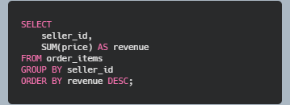

There are three sellers who made more than 220K revenue.

#### Top sellers by item sold

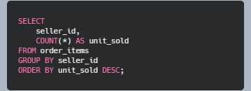

One of the sellers sold more than 2K units whereas there are two more sellers who sold more than 1900 units.

### Top customers
#### Average order value: how much money a customer spent per order?
To find this, I need to use *subquery*. I should consider: some orders may have *multiple payment records* (e.g., split across credit card + voucher) as there is a feature called *payment installment*. So, we may have multiple payments for the same *order_id*.

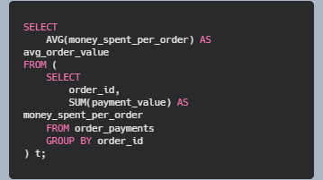

*Result:* The average order value is 160.99

#### How many customer purchased more than once? 
Count order per customer

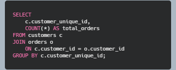

The above query gives the number of times the customers purchased. But if we want to only see the customers who purchased repeatedly (more than once), then the following query can be used.

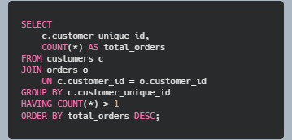

#### Count how many repeat customer exist.

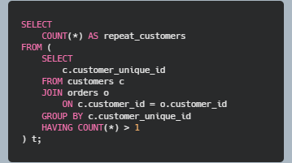

#### New vs Repeat customers: how many customers visited one time and how many customers are loyal and repeat coming?
This is a complex query that involves multiple steps:
First subquery: calculate orders per customer.
Second subquery: classify customer as One-time or Repeat.
Outer query: count how many customers fall into each category.

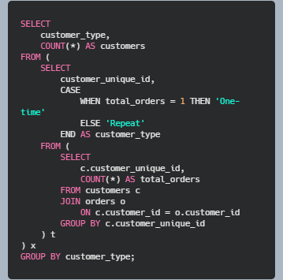

*Result* shows that most of the customers (93099) purchased one time and there are close to 3K customers who are loyal and purchased multiple times. From business perspective, a the company might want to attract the big chunk of visiting customers. 

### Review score analysis
#### Distribution of review score: How many 1-star, 2-star, 3-star, 4-star, and 5-star reviews are there?

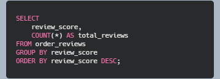

####  What is the percentage of review_score for 3, 4 and 5 in combined (positive review percentage)

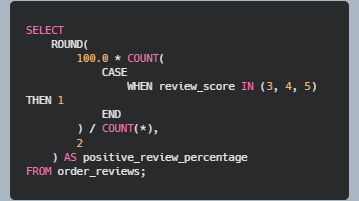

The percentage of positive reviews is 85.31% which shows a high satisfaction for the product. 

