## Customer and Seller Distribution Analysis

#### Business Query: Which states contribute most customers?

The customers table was used because it contains customer location information. Since the analysis is at the customer level, no additional joins are required.

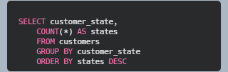

*Output:*

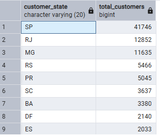

*Insights from output:* Customer distribution is highly concentrated in SP, which has more than three times the customers of the next largest state (RJ). The customer base is primarily concentrated in the regions SP, RJ, MG, suggesting these regions represent the strongest markets for the platform.

#### Business Query: Which states contribute the most sellers?

The sellers table was used because it contains seller location information. Since the goal is to measure marketplace supply by region, the analysis is performed directly on this table.

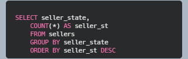

*Output:*

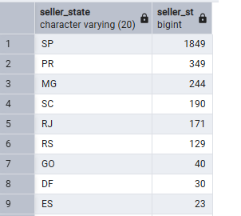

*Insights from output:* Seller distribution is highly concentrated in state SP, which accounts for a dominant share of marketplace sellers compared with other states. Similar to customer distribution, seller presence is strongest in the Southeast region, particularly SP and MG, indicating that this region acts as the primary marketplace hub.

## Payment Analysis
#### Business Query: What payment methods are popular?

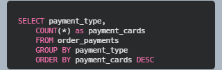

*Output:* 

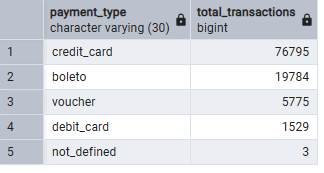

*Insights from output:* The output reflects that credit cards are the most widely used payment method, indicating a strong customer preference for card-based transactions. In addition, Boleto is the second most popular payment option, reflecting the continued use of traditional bank payment methods in Brazil.

#### Business Query: How are review scores distributed?

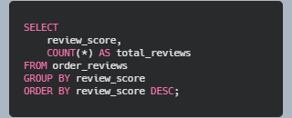

*Output:*

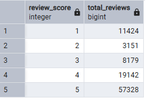

*Insights from output:* The review score distribution is positively skewed, with 4-star and 5-star ratings accounting for the majority of customer reviews. At the same time the number of 1-start or 2-stars are not insignificant, which shows the room for improvement. Generally, the unsatisfied customers leave comments, which can be great source of learning why customers are usually unhappy.  

#### Business Query: Average review score

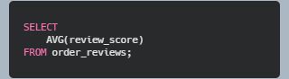

*Insights from output:* The average review score of 4.086 out of 5 indicates a generally high level of customer satisfaction with the marketplace. On average, customers rated their shopping experience positively, which suggests that products and services largely met customer expectations. However, the average also indicates that some lower-rated reviews exist, highlighting opportunities to further improve.

## Revenue Analysis

#### Business Query: Find total revenue

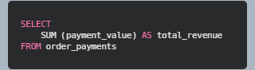

*Insights from output:* The company generated approximately 16 million in total revenue over the period covered by the dataset, demonstrating substantial sales activity. This metric provides context for subsequent analyses, such as revenue trends over time, regional contributions, and seller performance.

#### Business Query: Find revenue by month.

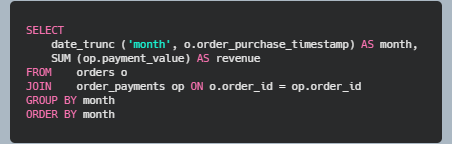

*Insights from output:* The revenue does not show a specific trend like a hike on a particular month or a group of months (as we usually see during the month of November due to black friday or during the month of December due to the Christmas). However, during the months of the year 2018 is much higher compared to the months of the other years.

#### Business Query: Find revenue by states
This is a complex situation where three tables should be involved. 

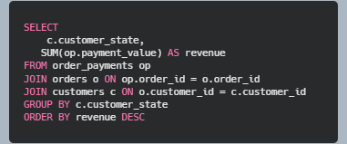

*Output:* 

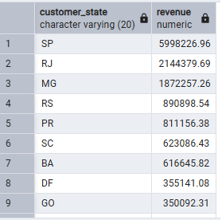

*Insights from output:* States SP, RJ, and MG contribute to the most amount of revenue. This also aligns with the number of customers and sellers in those states that was shown during dataset analysis. The result also indicate in which other states they can improve, perhaps by finding why they are not doing as good as they are doing in these three states. 

#### Business Query: Find revenue by seller
This is a tricky question. One way to solve it as following:

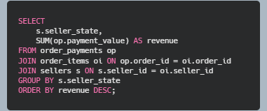

*Thinking from a different direction:* Since there may be orders that contain multiple items, an order might be counted multiple times, which will lead to a wrong answer. Instead of the above query, the following is much simpler and accurately represent the actual revenue.

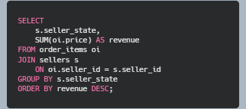

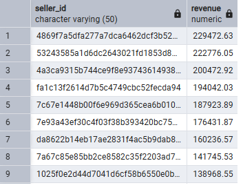

*Insights from output:* Seller revenue varies considerably across the marketplace, with the top-performing seller generating over 507,000 in revenue, nearly 1.6 times that of the second-highest seller. Identifying high-performing sellers can help the business understand successful selling strategies and develop targeted programs to support or incentivize other sellers.

## Top Product Category
Finding the top category product can be with respect to revenue or with respect to the number of products sold. 

#### Business Query: Top product category with respect to revenue earned

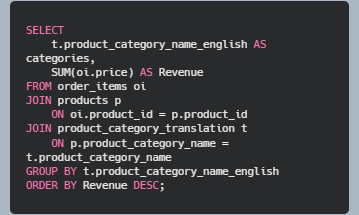

*Output:* 

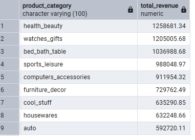

*Insights from output:* There are 71 categories of products. The product names are translated into their respective English names with the help of *product_category_translation* table. The *result* of the above query shows that *health_beauty* category generates the most revenue, whereas the *watches_gifts*, *bed_bath_table*, *sports_leisure*, and *computer_accessories* categories are not much behind as well. 

#### Business Query: Top category with respect to the unit sold

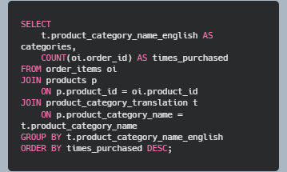

*Output:* 

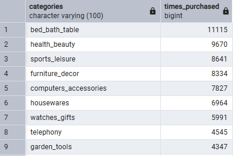

*Insights from output:* *bed_bath_table* category products are sold the most whereas the *health_beauty* category places second. It reveals that the *health_beauty* category products produces higher profit margin.  

## Top Sellers

#### Business Query: write

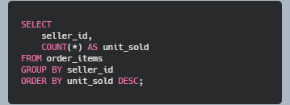

*Output:* 

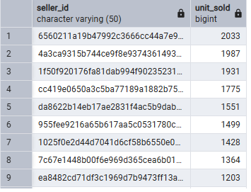

*Insights from output:* The distribution of units sold highlights sellers with the highest sales volume, indicating which sellers have the strongest customer demand and product movement. Comparing unit sales with revenue performance can reveal differences between high-volume sellers and high-value sellers (sellers generating more revenue through fewer, higher-priced items).

## Top Customers
#### Business Query: Average order value: how much money in average a customer spent per order?

To find this, we need to use *subquery*. We should consider: some orders may have *multiple payment records* (e.g., split across credit card + voucher) as there is a feature called *payment installment*. So, we may have multiple payments for the same *order_id*.

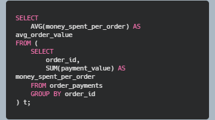

*Insights from output:* The average order value is 160.99, meaning that customers spent approximately 160.99 per order on average during the period covered by the dataset. This metric provides a baseline understanding of customer purchasing behavior and can be used to evaluate strategies aimed at increasing customer spending, such as product recommendations, promotions, or bundle offers.

#### Business Query: How many customer purchased more than once? 

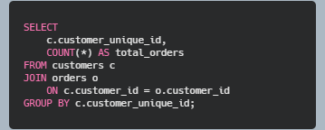

*Insights from output:* The above query gives the number of times the customers purchased. But if we want to only see the customers who purchased repeatedly (more than once), then the following query can be used.

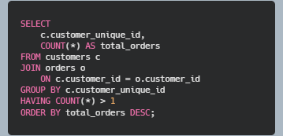

#### Business Query: Count how many repeat customer exist.

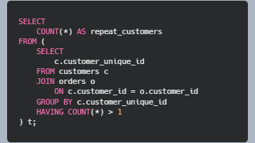

*Output:*

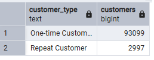

*Insights from output:* This is a vital discovery for the company! The analysis shows that the majority of customers are one-time buyers (93,099), while only 2,997 customers returned for additional purchases. This indicates that the marketplace has strong customer acquisition but relatively lower customer retention, suggesting an opportunity to improve loyalty and encourage repeat purchases. Strategies such as personalized recommendations, targeted promotions, loyalty programs, and improved post-purchase engagement could help convert one-time customers into returning customers. The company should also take initiative to identify the major reasons why the majority of the customers do not come back.

#### Business Query: New vs Repeat customers -- how many customers visited one time and how many customers are loyal and repeat coming?

This is in fact a compact query that combines the both queries above. This is a complex query that involves multiple steps:
First subquery: calculate orders per customer.
Second subquery: classify customer as One-time or Repeat.
Outer query: count how many customers fall into each category.

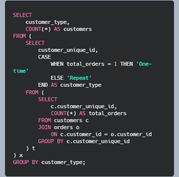

## Customer Satisfaction Analysis
#### Business Query: Distribution of review score -- How many 1-star, 2-star, 3-star, 4-star, and 5-star reviews are there?

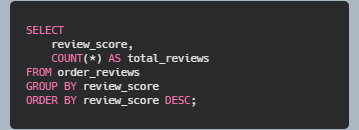

*Output:* 

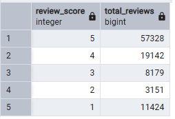

*Insights from output:* As can be seen from the output, the majority of the customers are happy with the products and perhaps the service as well. At the same time the company needs to identify why so many customers do not return despite the highly satisfactory reviews.

#### Business Query: What is the percentage of review_score for 3, 4 and 5 in combined (positive review percentage)

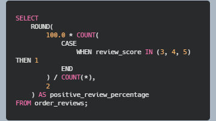
 
*Insights from output:* The percentage of positive reviews is 85.31% which shows a high satisfaction for the products/services. 

#### Business Query: Review score by state -- Which customer states are the most satisfied?

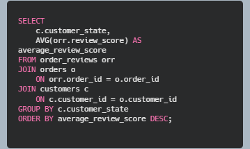

*Output:*

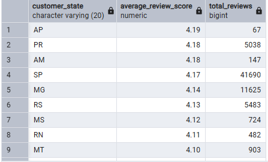

*Insights from output:* Customer satisfaction is consistently high across states, with the average review score reaches as high as 4.19, indicating a generally positive customer experience nationwide. States such as AP, PR, and AM show the highest average ratings, but some of these states have a relatively small number of reviews (e.g., AP with only 67 reviews). Therefore, these averages should be interpreted cautiously due to the smaller sample size. SP, which has the largest customer base and review volume (over 41,000 reviews), maintains a high average rating of 4.17, making it a more reliable indicator of overall customer satisfaction. The results suggest that customer satisfaction is not strongly dependent on geographic location; instead, further analysis could investigate other factors such as product category, delivery performance, or seller quality.

#### Business Query: Review score by product category -- which product categories received highest and lowest ratings?

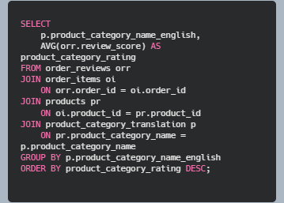

*Insights from output:* The above query is, in fact, order wise rating, not specific product/category wise rating. The dataset does not provide reviews for specific categories. Since an order may have multiple items, all the items are rated equally for order review. It’s a limitation of the dataset and we cannot reconcile this issue. One way we could follow is that we could first isolate the orders with a single item and then rate based on those orders only.

