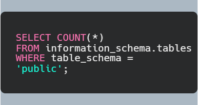
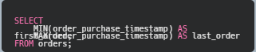
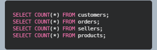
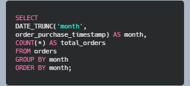
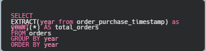
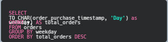

After getting the dataset, the first thing to know is how big the dataset is. How many tables are there and how many rows in each table. Knowing these will give an idea of the size of the dataset at hand.

First, let's know how many tables are there in the dataset? The following query will give the result:

The query output is 9

Next, determine the number of rows in each table. Here is a sample query for one table. The row numbers of the other table can be found using the same query.

*Query output: 99441*

similarly we get the following set of information 

| Table Name | Number of rows |
| -----------| ---------------|
| customers | 99441 |
| orders | 198882 |
| order_items | 112650 |
| products | 32951 |
| sellers | 3095 |
| order_payments | 103886 |
| order_reviews | 99224 |
| product_category_translation | 71 |
| geolocation | 2000326 |

*In total, there are 1.55 million rows*

Next, I wanted to know the time/ duration of the transections I will be dealing with. The information lies in the order_purchase_timestamp inside orders table. The following query helps find the information.

*The query result shows that the transections happened between the years 2016 and 2018*

Next, I would like to know the number of customers, orders, sellers, and products. These information is found in the respective tables using the following commands.

*The marketplace contains approximately 99k customers, 99k orders, 3k sellers, and 33k products. The relatively small number of sellers compared to products suggests that sellers typically offer multiple products, while the near one-to-one ratio between customers and orders indicates that many customers made only a single purchase.*

The next question does not directly focused on dataset exploration but rather related to business question. Still I wanted to know becasue the information will give me an idea about the distribution of the orders in the dataset.

How are orders distributed over time? This query will also reveal that whether the orders occur evenly over time or there are specific patterns or trends of the orders.
To find the answer, I counted the orders by month, year, and days.

Order by month:

*The result shows that the number of orders grew over months, reaching a peak of more than 7k orders in a month.*

Order by year:

*The number of orders over year also reflect the similar to that of months. The number of orders in 2016 was low, at 329, which grew to 45101 in 2017. In 2018, the toal number of orders were 54011, which surpassed all the records in the prvious two years.*

Orders by day: do customers buy more on weekdays or weekends?

*Here is the output:*
| Day of the Week | Total orders |
|-----------------| --------------|
| Monday|16196|
| Tuesday|15963|
|Wednesday|15552|
|Thursday|14761|
|Friday|14122|
|Saturday|11960|
|Sunday|10887|

*The number of orders are higher during the weekdays*

