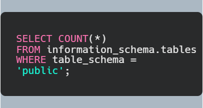
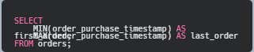
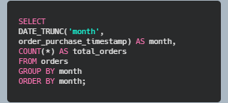
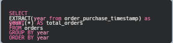
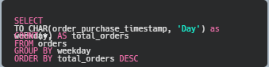

# Olist E-Commerce Dataset: Exploratory Data Analysis in SQL

Before diving into complex analysis, it is essential to understand the layout and scale of the data. This exploration uses the Olist Brazilian E-Commerce dataset to inspect table sizes, date ranges, core entity counts, and order distributions over time.

## 1. Dataset Scale & Schema Overview

To get a sense of the database's structural footprint, we start by checking how many tables exist in the schema.

*Result:* 9 tables

Next, we count the rows in each table to understand where the bulk of the data lives. Below is the query structure used for checking individual table row counts:

*Result: 99441*

Running similar queries across all tables gives us the following volume breakdown: 

| Table Name | Number of rows |
| -----------| ---------------|
| customers | 99441 |
| orders | 198882 |
| order_items | 112650 |
| products | 32951 |
| sellers | 3095 |
| order_payments | 103886 |
| order_reviews | 99224 |
| product_category_translation | 71 |
| geolocation | 2000326 |

*Key Takeaways:*
- Across all tables, the dataset contains over 1.55 million records.
- The geolocation table is by far the largest, holding over 2 million coordinate entries.
- Core transaction tables (orders, order_items, order_payments) make up the vast majority of operational activity.

## 2. Transaction Timeframe

To establish the historical scope of the data, we query the minimum and maximum order purchase timestamps in the orders table.

*Key Takeaways:*
- The transactions span from 2016 to 2018.
- This multi-year window provides enough historical depth to evaluate growth trajectories and seasonal shopping patterns.

## 3. High-Level Entity Summary

Counting unique entities across the core tables helps map out marketplace relationships.

*Key Takeaways:*
- Scale: The marketplace contains roughly 99k customers, 99k orders, 33k distinct products, and 3k sellers.
- Seller-to-Product Dynamics: With 3,095 sellers listing 32,951 products, the average seller offers ~10 unique items, showing a healthy variety of catalog offerings per merchant.
- Customer Retention: The near 1:1 ratio between customers and orders (99,441 customers to 99,441 orders) indicates low repeat purchase rates in this dataset—most customer IDs represent one-time buyers.

## Order Distribution Patterns

Analyzing how order volumes fluctuate across months, years, and days reveals operational activity peaks and customer buying behavior.

### Monthly Trend
Order by month:

*Insight:* Order volume grew steadily month-over-month, eventually peaking at over 7,000 orders in a single month as the platform gained adoption.

### Yearly Trend
Order by year:

- *Insight:* Platform activity accelerated dramatically each year:
    - 2016: 329 orders (initial platform launch period)
    - 2017: 45,101 orders (rapid scaling phase)
    - 2018: 54,011 orders (surpassing total 2017 volume despite covering a partial year)

### Day of the Week Trend: Weekdays vs. Weekends
Orders by day: do customers buy more on weekdays or weekends?

*Here is the output:*
| Day of the Week | Total orders |
|-----------------| --------------|
| Monday|16196|
| Tuesday|15963|
|Wednesday|15552|
|Thursday|14761|
|Friday|14122|
|Saturday|11960|
|Sunday|10887|

*Insight:* Purchasing activity peaks during early weekdays (Monday and Tuesday) and steadily declines toward the weekend, with Sunday recording the lowest order volume. This indicates that customers are more active shoppers during working hours than on weekends.

