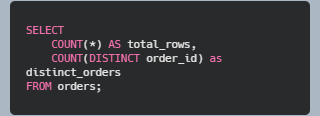
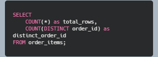
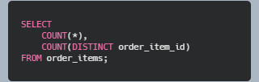

### Determine primary keys
A primary key is a specific column or a set of columns in a database table that uniquely identifies each record (row).
Two key indications to determine if a particular column is a primary key
*Is there any NULL value?*
*Is there any duplicate value?*

First, I take the table  *orders* and find out its primary key. The initial assumption is *order_id* as the primary key of *orders* table

*Test 1:* Check for duplicate values

This gives 99441 for both counts. It reveals that every row has a unique order_id (no duplicate!)

*Test 2:* Check for NULL values

This gives 0, meaning no NULL. it means that *order_id is the primary key*

#### Determining the primary key for the table *order_items*
Candidate columns for primary key: *order_id*, *order_item_id*

*Test 1:* Check duplicate for *order_id*

*Output:* total rows are 112650, and distinct_order_id is 98666
*Result* shows that there are more rows than orders than the number of unique order_id. This reveals that *order_id* is *not* unique (chance of duplicate order_ids). I want to make sure there are duplicate order_ids with the following queries:

This gives those order_ids that have more than 1 entries (rows) in the table (many orders have multiple rows). Most likely interpretation is that *there are multiple items in many orders*.

*Concluding remark*: one row != one order.

Since order_id is not unique, I no longer test for NULL for it.

*Test 2:* Check duplicate for *order_item_id*

*Output:* 112650, 21
It reveals there are only few types of items compared to the orders (21 items compared to 112650 rows). This means that order_item_id repeats across orders. *order_item_id* itself cannot be a primary key.

*Test 3:* Check if *order_id* and *order_item_id* combinedly are unique

*Result:* 112650 (equal to the number of rows in the table)
*Decision*: (order_id, order_item_id) is unique identifier
*Conclusion*: one row = one item within an order (this is the Grain, meaning what each row mean)

### Identify the Grain (what does each row mean in a table) of a table
The steps to find the Grain of a table overlap with dataset profiling steps.

*Step 1:*  Look at the columns 

And ask what business entity might this table represent?
Example: orders table has the following columns: order_id, customer_id, order_status, order_date
Initial guess : may be one row = one order

*Step 2:* Count total rows

Example: for orders table, number of rows are 99,441
This gives a context for later uniqueness tests,

*Step 3:*  Find candidate IDs.
Generally the ID columns are good candidates for primary key. But there might be	 multiple ID columns in a table. Hence, we need to conduct uniqueness test

*Step 4:* Test uniqueness. For a candidate column do:

If order_id = distinct_ids then order_id is unique
Possible grain : one row = one order

*Step 5:* Check for Duplicates (if above Uniqueness test fails, meaning there is a mismatch) to identify Which IDs have duplicates and how many entires do we have for each duplicate IDs.

*Step 6:*  If no single column is unique
Example: order_items table; Check the following:

The result will be 112,650 rows and 98,666 distinct orders. So order_id is not the Grain because multiple rows share the same order.
 
*Step 7:* Search for composite key, look for combinations. For the order_items table the following happens

Result: total rows = 112,650 and distinct rows for combination = 112,650. It means (order_id, order_item_id) uniquely identifies each row.

*Step 8:* Translate technical findings into business language
For order_items column, the finding (order_id, order_item_id) being a composite primary key tells us that one row = one item sold within an order . this is the Grain for the table

